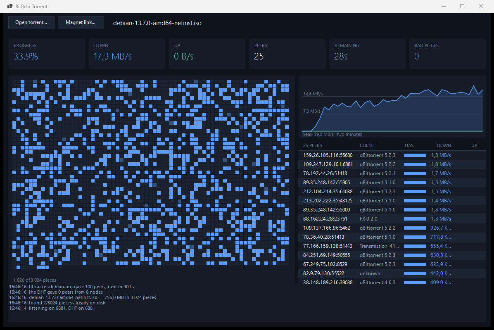

# Bitfield Torrent

A BitTorrent client written in C#, built from the protocol up: bencode, the peer
wire protocol, piece selection and the choking algorithm, with a Kademlia DHT
underneath for finding peers when there is no tracker to ask.

The name is the protocol's own: `bitfield` is the message a peer sends to say
which pieces it already has. It is also what the window is built around — the
piece map in the middle of the screen is a bitfield drawn out, filling in as the
download proceeds.



A third of the way into the Debian netinst ISO at 17.3 MB/s across 25 peers. The
speckle is what rarest first looks like: pieces arriving from all over the
torrent rather than in order, with the darker cells the ones in flight.

## Status

Milestone 9 of 9, most of the way. **It works and it has a window.** A torrent is read —
from a file, or from nothing but its hash by asking the swarm for its
description — its trackers answer over HTTP or UDP, the DHT finds peers with no
tracker at all, a few dozen peers are kept busy at once, pieces are picked
rarest first, and every piece that verifies is written across the files it
straddles. An interrupted download picks up where it left off. Peers that
connect are answered, blocks are served from disk, and the choking algorithm
decides which few are worth answering.

The window shows the piece map, the peers and the last two minutes of
throughput, and opens a torrent or a magnet link. Still missing from this last
milestone: rate limits and the UPnP port mapping.

**399 offline checks pass**, covering the bencode reader and writer, the
metainfo model, the announce request down to its exact bytes, every shape a
tracker reply arrives in, the peer handshake and every wire message, the piece
picker, the DHT's distance arithmetic, routing table and messages, and writing
pieces across file boundaries — plus three real torrent files whose infohashes,
piece counts and lengths are matched against values derived with a separate
implementation.

Among them are eight DHT nodes on loopback, where one announces a torrent and
another that has never heard of it looks the torrent up and is told where to
find it — and a swarm of this client talking to itself over loopback: a seed
and two leechers, and then **a third leecher that finishes with the seed
removed from the swarm entirely**, served only by the two peers that had just
downloaded it themselves. That needs the uploading side, the choking algorithm
and incoming connections all to be right at once. It takes about a second and
runs on every build.

Against the live swarm, on 2026-09-17:

| What | Result |
|---|---|
| **The Debian 13.7 netinst ISO, start to finish** | **792,723,456 bytes in 49.1 s — 15.39 MB/s average, 28 peers, no piece failed its hash** |
| **Its SHA-256 against Debian's published `SHA256SUMS`** | **`a7ef94ac…e355` — matches** |
| Resuming after 12 pieces were damaged | hashing found exactly those 12 in 2.6 s, re-fetched 3,145,728 bytes — 12 pieces to the byte — and the checksum matched again |
| `bttracker.debian.org` (HTTP) | answered in 190 ms with 50 peers |
| `torrent.ubuntu.com` (HTTPS) | answered in 348 ms, 1,608 seeders reported |
| Piece 0 from a qBittorrent 5.1.0 peer / an rqbit 8.1.1 peer | SHA-1 verified in 1,122 ms / 351 ms |
| The same ISO over HTTP from Debian's mirror, one stream, for comparison | 18.32 MB/s |
| **The same ISO from a magnet link — hash only, UDP tracker** | **description fetched from a stranger in 726 ms, then 792,723,456 bytes in 69.8 s, SHA-256 matching** |
| `tracker.opentrackr.org` (UDP) | 32 peers |
| The description from a magnet link, over an HTTP tracker | 60,578 bytes from an rqbit 8.1.1 peer, 562 ms, infohash verified |
| **The Debian ISO's peers from the real DHT, no tracker at all** | **joined in 41 s, then 100 peers in 12.3 s** |
| The same with last run's routing table restored | bootstrap routers skipped entirely, 100 peers in 8.3 s |
| Seeding that ISO to the public swarm for ten minutes | **nothing uploaded — see below** |

```
dotnet run --project tests/Bitfield.Tests -- announce [path to a .torrent]
dotnet run --project tests/Bitfield.Tests -- piece    [path to a .torrent]
dotnet run --project tests/Bitfield.Tests -- download <directory> [.torrent] [expected sha-256]
```

Nothing below is claimed as working until it has a measurement beside it.

## Scope

- **Metainfo and bencode** — `.torrent` parsing with the raw `info` bytes kept
  intact, because the infohash is the SHA-1 of those bytes exactly as they
  arrived, not of a re-encoding of them
- **Trackers** — HTTP announce, then UDP (BEP 15) with its connection handshake
- **Peer wire protocol** — handshake, `bitfield`/`have`, `choke`/`interested`,
  block requests in 16 KiB pieces, pipelined per peer
- **Piece selection** — random first while there is nothing to trade, rarest
  first in the middle, endgame duplication for the last few blocks
- **Choking** — tit-for-tat with four unchoke slots and a rotating optimistic
  unchoke, which is what makes the swarm work at all
- **Storage** — pieces mapped across file boundaries, sparse preallocation,
  hash verification before anything is written, resume after a restart
- **Magnet links** — the extension protocol (BEP 10) and `ut_metadata` (BEP 9),
  so a download can start from an infohash alone
- **DHT** — Kademlia routing table, `get_peers` and `announce_peer`, bootstrapped
  once and persisted afterwards

### Private torrents

Torrents carrying `private: 1` in the info dictionary are tracker-only by
design. The DHT, peer exchange and local peer discovery are all implemented, and
all three stay switched off for those torrents — that flag is not advisory.

## How it will be measured

The point of a client is that the bytes are right, so the checks are arranged to
say so rather than to look reassuring:

- **The finished file's SHA-256 matches the publisher's own checksum.** A Linux
  ISO downloaded end to end, verified against the distributor's `SHA256SUMS`.
- **Bencode round-trips byte for byte** across a corpus of real `.torrent` files,
  with the computed infohashes matching their published values.
- **A local swarm** — several instances of this client on one machine sharing a
  generated file — exercises seeding, choking and rarest-first without touching
  the public network, repeatably and fast enough to run on every build.
- **Interop in both directions** with an established client: downloading from it
  and seeding to it, which is what proves this speaks the protocol rather than a
  private dialect.
- **Throughput, peer counts and time to first DHT peer**, recorded rather than
  estimated.

## Milestones

| # | Milestone | Done when |
|---|---|---|
| **1** | **Bencode, metainfo, infohash** | **Done — computed infohashes match real `.torrent` files** |
| **2** | **HTTP tracker announce** | **Done — a live peer list comes back** |
| **3** | **One peer, one piece** | **Done — a single piece downloads and its SHA-1 verifies** |
| **4** | **Full download, multi-file, resume** | **Done — an ISO's published SHA-256 matches** |
| **5** | **Piece picker, pipelining, many peers** | **Done — sustained throughput on a real swarm** |
| **6** | **Seeding and choking** | **Done — the local swarm test passes** |
| **7** | **UDP trackers, magnet, `ut_metadata`** | **Done — a magnet link downloads from scratch** |
| **8** | **DHT** | **Done — peers found with no tracker involved** |
| 9 | The window: piece map, peers, graphs, rate limits, UPnP | — |

## Building

Needs the .NET 9 SDK.

```
dotnet build Bitfield.sln
dotnet run --project tests/Bitfield.Tests
```

## Layout

```
src/Bitfield.Core    protocol, piece selection, storage, DHT
src/Bitfield         the Windows Forms application
tests/Bitfield.Tests offline checks
```

## Notes

### The routing table is worth nothing without its id

The DHT's buckets are cut by distance from this node's own id, and a node that
comes back under a fresh id has a table sorted for somebody else. Measuring it
made that concrete: of 81 saved nodes, 16 survived being restored. Saving the
id alongside them takes the figure to all of them, and the bootstrap routers —
which carry the first question of every client on the network — can then be
left alone entirely.

The other half of the same point is that other nodes' tables go on pointing at
the id this one had last time, so changing it every run throws that away too.

### A magnet link is a hash and a promise

A magnet link carries the torrent's infohash and, beyond that, only hints: a
name to show, some trackers to try, sometimes a peer or two. The description
that would have been in a `.torrent` file has to be asked of the swarm, which
means taking it from a stranger who has every opportunity to hand over a
description of something else.

What makes that safe is the same thing that makes the pieces safe. The
description's SHA-1 has to be the infohash the link asked for, so a substituted
one is caught before a byte of it is believed — and the bytes are kept exactly
as the peer sent them, because that hash is taken over those bytes rather than
over a re-encoding, which is the same reason a torrent read from a file keeps
its info dictionary's original range.

The name in the link is treated as what it is: in the swarm test the link says
one thing and the fetched description says another, and it is the description
that wins.

### Uploading to strangers is not demonstrated yet

Seeding the finished Debian ISO to the public swarm for ten minutes uploaded
nothing at all. Instrumenting the connections says why rather than leaving it
to be guessed at: of the peers connected, every one that got as far as sending
its bitfield held the whole torrent already — nine out of nine on the last run.

A heavily seeded torrent has few leechers, and the leechers it does have dial
out to seeds rather than waiting to be dialled. This client is not listening on
a port anything can reach, so those leechers cannot arrive, and the peers it
reaches out to itself are seeds with nothing to want. What the ten minutes
measured is the shape of that swarm and the absence of an open port, not the
code that serves blocks.

That code is exercised, just not by strangers: the loopback swarm has this
client serving a full torrent to a peer that started with nothing, with no
original seed present. Settling it properly needs a reachable port — the UPnP
mapping is milestone 9 — or a run against an established client on the same
machine. Neither has been done, so nothing here claims it.

### Why the swarm test removes the seed

A client can be made to download from a peer that has everything without most
of it working: no uploading, no choking, nothing listening. The test therefore
has a second phase. The seed is shut down, and a fresh leecher is pointed at
the two peers that just finished — so the only copies left in the swarm are the
ones this client produced and is now serving. It completes, and its bytes match
the original.

### What rarest first did and did not do

Rarest first and adaptive pipelining went in expecting the download to get
faster. It did not: 49.1 s against the 48.0 s the same ISO took when pieces
were picked in order with a fixed sixteen requests outstanding. The same file
over HTTP from Debian's own mirror, one stream, comes down at 18.32 MB/s, and
this client reaches about 85% of that — so what limits it is the line, not the
order the pieces are asked for.

The change is doing its job; it is simply not the thing in the way. Adaptive
pipelining is visible in the run: the fastest peer of that download was being
kept waiting on 73 blocks at once, against the flat sixteen it would have had
before. And rarest first earns its place for a different reason than speed — it
stops a torrent needing, at 99%, a piece only one departed peer ever had, and
it is what spreads a new piece through a swarm instead of everyone queueing at
the same seed. Neither shows up in the time to fetch a well-seeded Debian ISO.

### Why the finished file is checked against somebody else's number

Every piece is checked against a hash from the torrent file, so a download that
completes is self-consistent by construction — which means it proves nothing on
its own. The measurement that counts is the SHA-256 of the finished ISO against
the one Debian publishes: made by someone else, about the same bytes, and
nothing in this repository can influence it.

### Why nothing is trusted until it hashes

Any peer can send any bytes. The torrent file carries a SHA-1 for every piece,
and a piece whose hash does not match is thrown away rather than written — that
check is the only thing between a swarm of strangers and the file on disk, and
it is the reason a download from people nobody vouches for can be relied on at
all.

It is worth being clear about which risk this covers. The hashes come from the
torrent file, so they are only as trustworthy as wherever that came from; what
they guarantee is that the bytes assembled here are the bytes that torrent
describes, whoever sent them and however many peers they came from.

### Why the announce URL is built by hand

The infohash and peer id go into the tracker's query string as twenty raw bytes
each, not as text. Handing them to a general-purpose URL encoder means deciding
what encoding those bytes are text in, and whichever is chosen, the bytes that
are not valid in it come back replaced rather than escaped. The result is a
different infohash, and every tracker answers that it has never heard of the
torrent. So the bytes are percent-encoded one at a time, and a check compares
the finished URL against one built by a different encoder.

### Why the info dictionary is kept as bytes

A torrent's identity is the SHA-1 of its info dictionary, taken over the bytes
as they appear in the file. Parsing that dictionary and hashing a re-encoding of
it looks equivalent and is not: a file may carry keys this client has never
heard of, or carry them in an order it would not have chosen, and either
difference produces a hash that no peer and no tracker recognises. So the parser
records the byte range of every value it reads, and the infohash is taken
straight from the file.

The checks hold it to that from both sides: every real torrent file re-encodes
to the same bytes it came from, and a synthetic torrent with unsorted and
unknown keys in its info dictionary keeps its own identity rather than a tidied
one.


## License

MIT. Demonstrations use freely distributable torrents — Linux distributions and
Internet Archive material.
